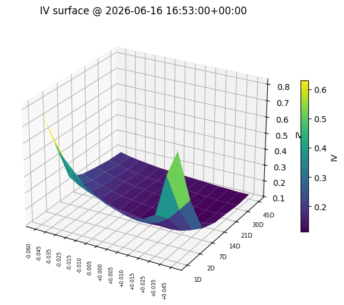
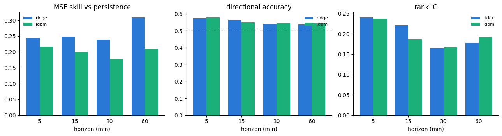
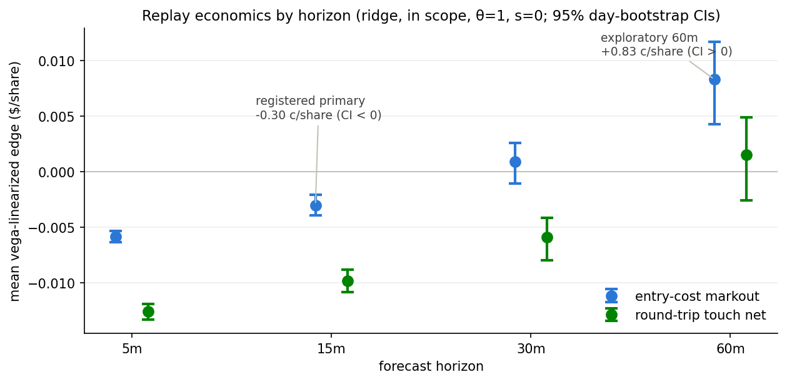

# Short-Horizon Options-Surface Forecasting

Forecasting short-horizon implied-volatility surface dynamics for SPY options,
built on Databento OPRA consolidated quote data, with every expectation
pre-registered before the corresponding run, and an execution-aware verdict.

## What's here

| Path | Contents |
|------|----------|
| [`memo/`](memo/) | Research memo (LaTeX source + PDF): the headline write-up covering the question, pre-registered expectations, results, what changed between rounds, and the execution-replay verdict. |
| [`notebooks/`](notebooks/) | Six analysis notebooks covering the full arc (data ingestion, surface construction, labels and leakage tests, baselines, the PyTorch sequence model, and the execution-aware replay), committed **with rendered outputs**. The underlying OPRA data is licensed and not redistributed, so the notebooks ship executed rather than re-runnable. |
| [`results/`](results/) | Committed derived artifacts of the pre-registered replay run (summary grids, bootstrap CIs, attribution decomposition, validity diagnostics) plus a provenance manifest with code commit and data checksums. Notebook 06 and the memo's replay section render from exactly these tables. |

## The short version

- **Data**: tick-level top-of-book quotes for the full SPY option chain
  (Databento OPRA CMBP-1, consolidated NBBO) and the SPY underlying
  (Nasdaq MBP-1), over 64 trading sessions (Mar 31 – Jul 1, 2026); roughly
  44 billion raw quote records over the initial 21-session panel, built into
  quality-gated, arbitrage-screened volatility-surface states on a
  one-minute grid.
- **Task**: forecast per-cell implied-volatility changes at 5–60-minute
  horizons (primary: 15 minutes) against a persistence null, under purged
  walk-forward validation with mechanical leakage probes and shuffled-label
  controls.
- **Method**: expectations registered before each run; negative results
  reported as registered, including a deep-learning architecture sweep
  that added nothing, and a feature finding that flipped sign between a
  one-month and a three-month panel.
- **Verdict**: the forecast is real (ridge beats persistence by ~26% MSE
  skill; the signal is mostly linear), but a pre-registered execution-aware
  replay adjudicates the 15-minute horizon **negative**: the model prices
  cell-median dislocations the tradable contract doesn't realize, and the
  markout does not clear the touch. An exploratory sweep finds the same
  forecasts clear entry costs decisively at 60 minutes: the next
  pre-registerable hypothesis, not a claimed win.

## At a glance

The one-minute SPY implied-volatility surface the pipeline builds
([notebook 02](notebooks/02_surface_construction.ipynb)):

Out-of-sample skill versus persistence, June panel, recomputed live under the
purged walk-forward protocol ([notebook 04](notebooks/04_baseline_models.ipynb)):

And the economic verdict from the pre-registered replay, rendered from the
[committed result tables](results/replay/): negative at the registered
15-minute primary, decisively positive on entry cost at the exploratory
60-minute horizon ([notebook 06](notebooks/06_execution_aware_replay.ipynb)):

## What is public, what is not

The implementation (surface builder, feature layer, walk-forward harness,
leakage probes, models, replay engine) lives in a private research
repository; this repo publishes the write-up, the executed notebooks, and
the derived result artifacts with their provenance manifest.

Read the [memo](memo/memo.pdf) for the full story.
